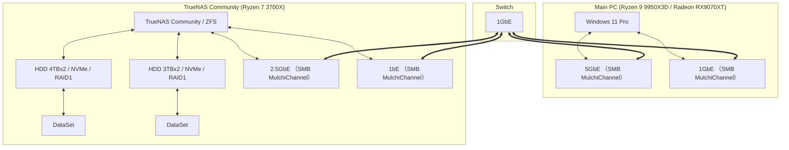
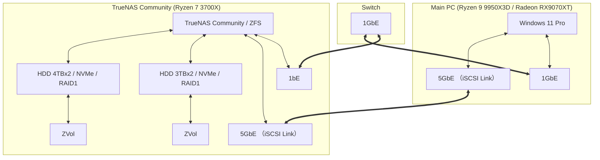
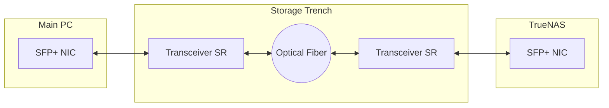

## iSCSI（SAN）への変更

### 変更前

#### 変更前の特徴

1. NASを構築し、データバックアップを行う

    * RYZEN 7 3700X & X570 & 332GB RAM & GeForce 1050TiのPCに、TrueNAS Communityを入れ、SMBサービスを使ってファイル共有を行い、SMB3のマルチチャネルで2Gbpsの通信速度を確保。
    * ROBOCOPYコマンドでオプションに/mirを指定しMainPCのデータを正として、TrueNASのバックアップを副として運用。
    * ROBOSOPYのオプションの/MT:4を使い2GBpsの帯域を使い切るように調整。
    * HDDによるRAID1構成のため、初期の書き込みではHDDの速度が上限となるが、2度目以降はNVMe SSDをストレージプールに追加しL2ARCによる高速化を図っている。

#### 変更前のネットワーク構成図



### 変更後

#### 変更後の特徴

1. SANを構築し、データバックアップを行う

    * MainPCのオンボードの5GbEのRJ45ポートとTrueNASの増設した5GbEのRJ45のNICの速度を活かすため、Cat.6ケーブルを直結し、iSCSIによるSANを構築。
    * Layer7のSMBプロトコルからLayer4のSCSI on TCP/IPへ移行し、オーバーヘッドを削減。
    * フレームバッファを9000 (9014)バイトに設定。
    * この図だとオーバーヘッドが増えているように見えるが、SMBは認証、ファイル使用状況の確認などを挟み、パケットにヘッダーを追加している。

        ```mermaid
        flowchart LR
            subgraph "App (Layer 7)"
                L72[App]
                L72 <--> I70[OS]
            end

            subgraph "SMB （Layer 7 <-> Layer4）"
                I70 <--> S73[SMB Header / Auth / Metadata]
            end

            subgraph "iSCSI （Layer 4 / Block）"
                I70 <--> I40[FS / Block]
                I40 <--> I41[iSCSI / SCSI Command]
            end

            subgraph "TCP/IP（Layer3）"
                S73 <--> S3[TCP]
                I41 <--> S3[TCP]
                S3 <--> S2[IP]
            end
            subgraph "Layer2"
                S2 <--> S1[Ethernet]
            end
        ```

    * TrueNAS側のメモリキャッシュがいっぱいになるまでは4.9Gbpsの速度を確認した。
    * 比較的大きなファイルの書き込みでは1.8Gbpsに貼り付くので、バイトに換算すると230MB/sはHDDの書き込み速度の上限だと思われる。
    * ファイルの更新チェックなどL2ARCが利くときは一瞬で終わる。
    * ROBOCOPYのMTオプションでのHDDへの書き込み速度は影響しないが、ネットワークの占有率と占有時間は変化する。

#### 変更後のネットワーク構成図



### 変更予定

SSDの価格が下落してきたあかつきには、TrueNASをヘッドレスサーバーにしてNVMe SSD 4枚挿しをし、SANの高速化を図りたい。またそのときにはMainPCとTrueNASの間をSPF+とトランシーバーと光ファイバーを導入して10Gbps以上の速度向上を図りたい。


