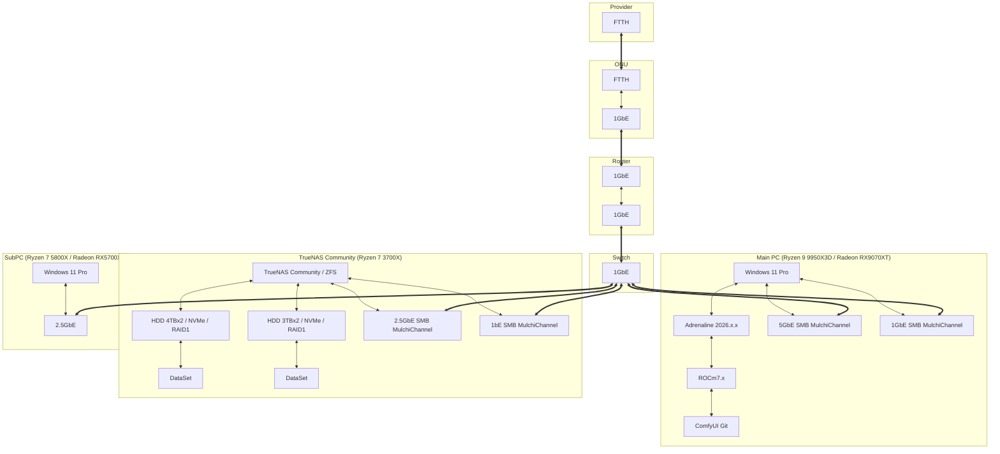
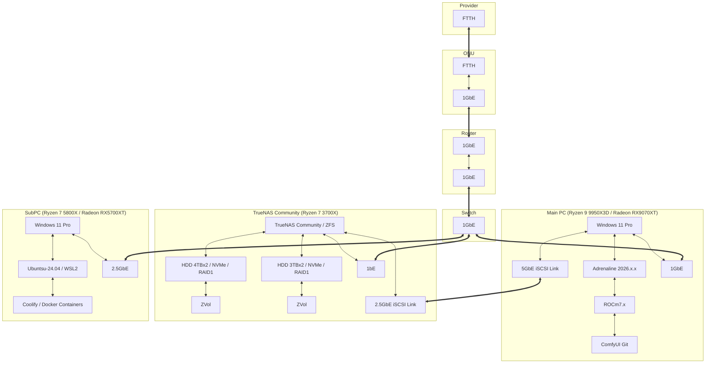
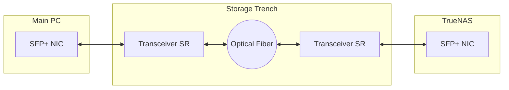

## ネットワーク構成

### 変更前

#### 変更前の特徴

1. NASを構築し、データバックアップを行う

    * RYZEN 7 3700X & X570 & 332GB RAM & GeForce 1050TiのPCに、TrueNAS Communityを入れ、SMBサービスを使ってファイル共有を行い、SMB3のマルチチャネルで2Gbpsの通信速度を確保。
    * ROBOCOPYコマンドでオプションに/mirを指定しMainPCのデータを正として、TrueNASのバックアップを副として運用。
    * ROBOSOPYのオプションの/MT:4を使い2GBpsの帯域を使い切るように調整。
    * HDDによるRAID1構成のため、初期の書き込みではHDDの速度が上限となるが、2度目以降はNVMe SSDをストレージプールに追加しL2ARCによる高速化を図っている。

2. サブPC

    * RYZEN 7 5800X & B550 & 32GB RAM & RADEON RX5700XTのPCに、Windows 11 Pro 25H2をインストールし、冷却にCorsair iCUE TITAN 240 RXを採用。

#### 変更前のネットワーク構成図



### 変更後

#### 変更後の特徴

1. SANを構築し、データバックアップを行う

    * MainPCのオンボードの5GbEのRJ45ポートとTrueNASの増設した2.5GbEのRJ45のNICの速度を活かすため、Cat.6ケーブルを直結し、iSCSIによるSANを構築。
    * Layer7のSMBプロトコルからLayer4のSCSI on TCP/IPへ移行し、オーバーヘッドを削減。
    * フレームバッファを9000 (9014)バイトに設定。
    * この図だとオーバーヘッドが増えているように見えるが、SMBは認証、ファイル使用状況の確認などを挟み、パケットにヘッダーを追加している。

        ```mermaid
        flowchart LR
            subgraph "App (Layer 7)"
                L72[App]
                L72 <--> I70[OS]
            end

            subgraph "SMB (Layer 7 <-> Layer4)"
                I70 <--> S73[SMB Header / Auth / Metadata]
            end

            subgraph "iSCSI (Layer 4 / Block)"
                I70 <--> I40[FS / Block]
                I40 <--> I41[iSCSI / SCSI Command]
            end

            subgraph "TCP/IP"
                S73 <--> S3[TCP]
                I41 <--> S3[TCP]
                S3 <--> S2[IP]
                S2 <--> S1[Ethernet]
            end
        ```

    * 現在のところ連続書き込みはHDDの速度で頭打ちのため2.5GbEの性能はよく分からない。比較的大きなファイルの書き込みでは1.8Gbpsに貼り付くので、およぞ230MB/sはHDDの書き込み速度の上限だと思われる。ファイルの更新チェックなどL2ARCが利くときは一瞬で終わる。

2. サブPC

    * SATA SSD 1TBを追加。
    * BIOSでCPUのSVMを有効にし、WSL2をインストール、WSL2にUbuntu-24.04をインストール。
    * Userフォルダーに`.wslconfig`を作成し以下の項目を記入。

        ```text
        [wsl2]
        networkingMode=mirrored
        ```

    * Ubuntu-24.04に、Coolify（ローカル環境用PaaSサービス）をインストール。

#### 変更後のネットワーク構成図



### 変更予定

SSDの価格が下落してきたあかつきには、TrueNASをヘッドレスサーバーにしてNVMe SSD 4枚挿しをし、SANの高速化を図りたい。またそのときにはMainPCとTrueNASの間をSPF+とトランシーバーと光ファイバーを導入して10Gbps以上の速度向上を図りたい。


